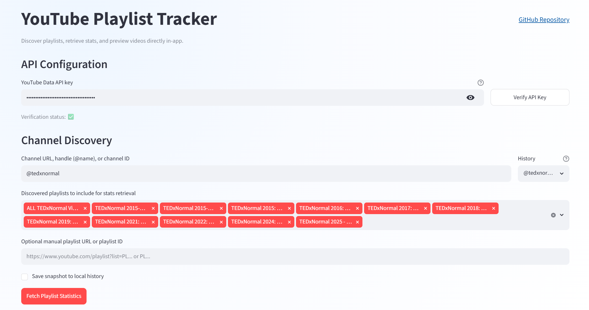
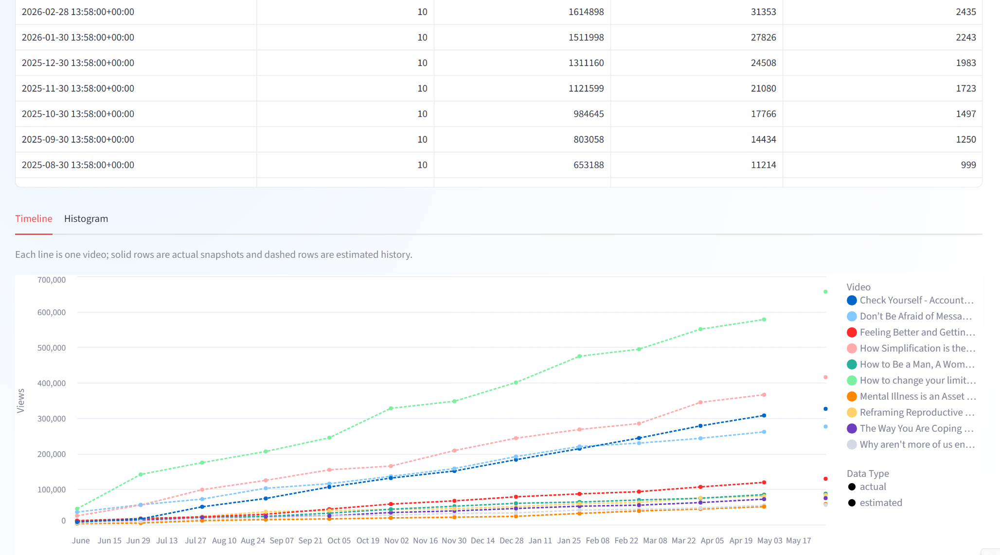

# YouTube Playlist Tracker

Explore public YouTube playlist performance with two run options:
1. Streamlit web app in VS Code (interactive dashboard).
2. Jupyter notebook in VS Code (run-once validation and snapshots).

<p align="center">
  
</p>

<p align="center">
  
</p>

## Run Options

### Option A: Streamlit Web App (Primary)
Use this for interactive discovery, multi-playlist retrieval, timeline/histogram views, and in-app video preview.

1. Install Python 3.10+.
2. Install Visual Studio Code.
3. Open folder: `C:\repos\youtube-playlist-tracker`.
4. Open terminal in VS Code.
5. Install dependencies:

```bash
pip install -r requirements.txt
```

6. Start the app:

```bash
streamlit run app.py
```

7. Open the local URL shown in terminal (usually `http://localhost:8501`).

### Option B: Notebook Validation (Secondary)
Use this for one-time checks, exploratory pulls, and optional snapshot writes.

1. Open [youtube_playlist_tracker.ipynb](youtube_playlist_tracker.ipynb) in VS Code.
2. Run cells in order (starting with the dependency/import cell).
3. Provide API key via prompt or environment variable.
4. Set playlist inputs and run retrieval cells.

Note: keep notebook as validation workflow, and use Streamlit app for ongoing analysis.

## API Key Setup

The app includes direct help links in the API key section.

1. Create or select a Google Cloud project.
2. Enable YouTube Data API v3.
3. Create an API key.
4. Restrict the key to YouTube Data API v3.

You can provide key by either method:
1. Enter directly in app/notebook prompt.
2. Store locally in `.streamlit/secrets.toml` as `YOUTUBE_API_KEY`.

## What The App Does

1. Verifies API key before retrieval.
2. Discovers playlists by channel URL, handle, channel ID, or query.
3. Retrieves per-video statistics for selected playlists.
4. Supports optional manual playlist URL/ID override.
5. Shows per-playlist tables, combined totals, and CSV exports.
6. Shows one-playlist-at-a-time history charts:
   Timeline mode with one line per video.
   Histogram mode for total views over time.
7. Distinguishes `actual` vs `estimated` history data.
8. Offers estimated history backfill for visualization.

## Security Notes

1. `.streamlit/secrets.toml` is local plain text (convenient, not encrypted).
2. Do not commit personal keys.
3. Use `youtube_playlist_tracker.local.ipynb` for private notebook work.
4. `*.local.ipynb` is ignored by Git.

## Project Files

1. `app.py` - Streamlit UI and analytics workflows.
2. `youtube_tracker/youtube_api.py` - YouTube API helpers.
3. `youtube_tracker/storage.py` - Local config and snapshot history utilities.
4. `youtube_playlist_tracker.ipynb` - Notebook run path.
5. `requirements.txt` - Python dependencies.

## Closing Notes

Current next step is to package this as:
1. A standalone web app deployment.
2. A WordPress plugin integration.
